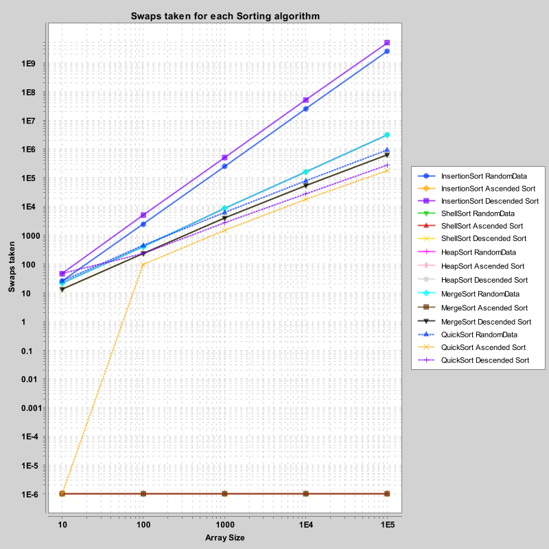
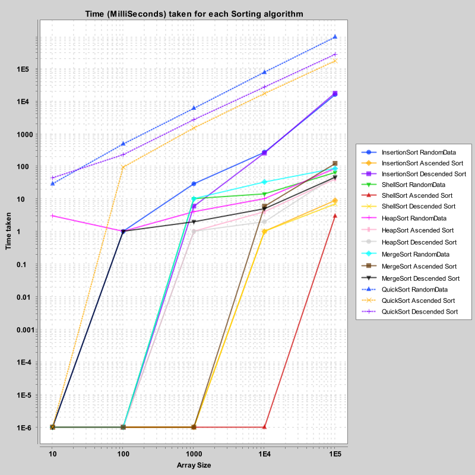

# Week 2 Assignment Answers to the questions:
---

1. Before running the program, what were your performance expectations for each of the algorithms as the data set size increased?

*Insertion sort:*
    Because of my knowledge of insertion sort, I expected that once the array grew to 1k or more that insertion sort would prove to have too much computational time as well as an absurd amount of swaps.

*Shell sort:*
I expected shell sort to preform much in the same as insertion sort, simply wih a little less swaps at once. This was simply due to the fact that ShellSort sometimes does not need to swap every single time it runs through the Hibbins number. I expected that as the dataset grew larger though it would start to slow down and be less of a good idea for something like a randomized array.

*Heap Sort:*
I did not have much of an expectiation either way within heap sort as I have not yet studied it in detail. However, I do know that it is a relatively fast algorithm and did expect it to have similar results to something like mergesort due to the tree system and then heapafying it. For very large datasets due to how many steps it takes to float something up to the top to them put into the array as sorted I expected that datasets of 100K would take awhile to do even if the time complexity is nlogn.

*Merge sort:*
I expected merge sort to have minimal number of swaps as well as be one of the faster algorithms. I also expected it to handle the larger datasets of something like 10k well due to the divide and conquer.

*Quick sort:* Overall I expected quicksort to have the same expectations as mergesort and be good on large data.

2. Describe how each of the sort algorithms performed on each of the datasets compared to one another as the dataset sizes increased. 

For the randomized imput, as expected Insertion Sort has the highest swap count and time, increasing drastically with array size. ShellSort, HeapSort, and MergeSort all have identical swap counts and time for each size abd Quick Sort performed the best in terms of swap count and time especially for 1000+ elements.

For the sorted ascending dataset everything but quicksort had 0 swaps, which is probably due to how the partitioning was coded up. I sort of wonder if there is a way to change this or if this is simply a thing of quickSort that it doesnt do well on already sorted arrays. As for the time there were changes in how each preformed with Insertion, Shell, and Heap being basically 0milliseconds, on everything but the large datasets (i set 1E-6 == 0 since I cant do log(0) graphing). However mergesort was quite a bit slower on the largest dataset which is possibly because of the way it went down recursively and then had to remerge the arrays. 

FOr the sorted Decending imput Insertion sort once afain Extremely slow, including having an absolutely absurd amount of swap counts. Quick Sort in terms of the time was slower than randomized but better than Insertion and for swaps was better than Insertion but worse than Shell/Heap/Merge....Whereas Shell/Heap/ and Merge stayed pretty stead 

3. Which sort algorithm would you use for a dataset with less than 25 elements? Which sort algorithm would you use for a dataset with greater than 25 elements? Which sort algorithm would you use for a dataset if all you knew about a data set was that it could contain anywhere between 25 and 1,000,000 elements?

Insertion Sort is highly inefficient for large or reversed datasets.
Shell, Heap, and Merge Sort show consistent, average performance in both swap count and time.
Quick Sort is the most efficient overall, except in sorted cases, where it may do extra swaps.

Since it was given to us that Insertion sort is good for < 20 elements pushing it to 25 I do not think it would make much of a difference. The algorithms that preformed the most consistantly were Shell, Heap, and MergeSort and Quicksort had some variability in its preformance. Therefore, I believe I would want to use ShellSort for datasets that I knew were anywhere between 25-100 elements and then switch to either Heap, merge or QuickSort from things greater than 100. However, if I knew that the dataset would contain already pre-sorted arrays and not random arrays I would want to switch to Shell Sort or Heap Sort.


# Extra Credit images (See the included folder for individual graphing):
I don't really trust the way the graphing ended up since it showed QuickSort being the slowest. However, there are so many variables to consider and debug that I have spent too much time on this assingment already; so it shall be submitted in this state anyways. I would have loved to use python for this instead of java if I am being honest... Java isn't necessarily the best for Data Analysis.





Texual Data (Since I dont actually trust my graphs based on Quicksort):

```
randomized
        insertion sort on a 10 element array, swap count=25.0 Time in milliseconds= 0.0
        shell sort on a 10 element array, swap count=21.0 Time in milliseconds= 0.0
        heap sort on a 10 element array, swap count=21.0 Time in milliseconds= 1.0
        merge sort on a 10 element array, swap count=21.0 Time in milliseconds= 0.0
        quick sort on a 10 element array, swap count=25.0 Time in milliseconds= 0.0

        insertion sort on a 100 element array, swap count=2363.0 Time in milliseconds= 0.0
        shell sort on a 100 element array, swap count=389.0 Time in milliseconds= 0.0
        heap sort on a 100 element array, swap count=389.0 Time in milliseconds= 0.0
        merge sort on a 100 element array, swap count=389.0 Time in milliseconds= 0.0
        quick sort on a 100 element array, swap count=435.0 Time in milliseconds= 0.0

        insertion sort on a 1000 element array, swap count=247449.0 Time in milliseconds= 8.0
        shell sort on a 1000 element array, swap count=8489.0 Time in milliseconds= 2.0
        heap sort on a 1000 element array, swap count=8489.0 Time in milliseconds= 3.0
        merge sort on a 1000 element array, swap count=8489.0 Time in milliseconds= 1.0
        quick sort on a 1000 element array, swap count=6063.0 Time in milliseconds= 1.0

        insertion sort on a 10000 element array, swap count=2.4683881E7 Time in milliseconds= 139.0
        shell sort on a 10000 element array, swap count=156865.0 Time in milliseconds= 11.0
        heap sort on a 10000 element array, swap count=156865.0 Time in milliseconds= 15.0
        merge sort on a 10000 element array, swap count=156865.0 Time in milliseconds= 19.0
        quick sort on a 10000 element array, swap count=76588.0 Time in milliseconds= 6.0

        insertion sort on a 100000 element array, swap count=2.496827117E9 Time in milliseconds= 12529.0
        shell sort on a 100000 element array, swap count=3055653.0 Time in milliseconds= 53.0
        heap sort on a 100000 element array, swap count=3055653.0 Time in milliseconds= 75.0
        merge sort on a 100000 element array, swap count=3055653.0 Time in milliseconds= 78.0
        quick sort on a 100000 element array, swap count=922570.0 Time in milliseconds= 51.0


sorted ascending
        insertion sort on a 10 element array, swap count=0.0 Time in milliseconds= 0.0
        shell sort on a 10 element array, swap count=0.0 Time in milliseconds= 0.0
        heap sort on a 10 element array, swap count=0.0 Time in milliseconds= 0.0
        merge sort on a 10 element array, swap count=0.0 Time in milliseconds= 0.0
        quick sort on a 10 element array, swap count=0.0 Time in milliseconds= 0.0

        insertion sort on a 100 element array, swap count=0.0 Time in milliseconds= 0.0
        shell sort on a 100 element array, swap count=0.0 Time in milliseconds= 0.0
        heap sort on a 100 element array, swap count=0.0 Time in milliseconds= 0.0
        merge sort on a 100 element array, swap count=0.0 Time in milliseconds= 0.0
        quick sort on a 100 element array, swap count=95.0 Time in milliseconds= 0.0

        insertion sort on a 1000 element array, swap count=0.0 Time in milliseconds= 0.0
        shell sort on a 1000 element array, swap count=0.0 Time in milliseconds= 0.0
        heap sort on a 1000 element array, swap count=0.0 Time in milliseconds= 1.0
        merge sort on a 1000 element array, swap count=0.0 Time in milliseconds= 1.0
        quick sort on a 1000 element array, swap count=1472.0 Time in milliseconds= 1.0

        insertion sort on a 10000 element array, swap count=0.0 Time in milliseconds= 1.0
        shell sort on a 10000 element array, swap count=0.0 Time in milliseconds= 1.0
        heap sort on a 10000 element array, swap count=0.0 Time in milliseconds= 3.0
        merge sort on a 10000 element array, swap count=0.0 Time in milliseconds= 21.0
        quick sort on a 10000 element array, swap count=17025.0 Time in milliseconds= 2.0

        insertion sort on a 100000 element array, swap count=0.0 Time in milliseconds= 2.0
        shell sort on a 100000 element array, swap count=0.0 Time in milliseconds= 9.0
        heap sort on a 100000 element array, swap count=0.0 Time in milliseconds= 44.0
        merge sort on a 100000 element array, swap count=0.0 Time in milliseconds= 126.0
        quick sort on a 100000 element array, swap count=173202.0 Time in milliseconds= 20.0


sorted descending
        insertion sort on a 10 element array, swap count=45.0 Time in milliseconds= 0.0
        shell sort on a 10 element array, swap count=13.0 Time in milliseconds= 0.0
        heap sort on a 10 element array, swap count=13.0 Time in milliseconds= 0.0
        merge sort on a 10 element array, swap count=13.0 Time in milliseconds= 0.0
        quick sort on a 10 element array, swap count=45.0 Time in milliseconds= 1.0

        insertion sort on a 100 element array, swap count=4950.0 Time in milliseconds= 0.0
        shell sort on a 100 element array, swap count=230.0 Time in milliseconds= 0.0
        heap sort on a 100 element array, swap count=230.0 Time in milliseconds= 0.0
        merge sort on a 100 element array, swap count=230.0 Time in milliseconds= 0.0
        quick sort on a 100 element array, swap count=229.0 Time in milliseconds= 0.0

        insertion sort on a 1000 element array, swap count=499500.0 Time in milliseconds= 3.0
        shell sort on a 1000 element array, swap count=3920.0 Time in milliseconds= 0.0
        heap sort on a 1000 element array, swap count=3920.0 Time in milliseconds= 1.0
        merge sort on a 1000 element array, swap count=3920.0 Time in milliseconds= 2.0
        quick sort on a 1000 element array, swap count=2649.0 Time in milliseconds= 1.0

        insertion sort on a 10000 element array, swap count=4.9995E7 Time in milliseconds= 167.0
        shell sort on a 10000 element array, swap count=53704.0 Time in milliseconds= 0.0
        heap sort on a 10000 element array, swap count=53704.0 Time in milliseconds= 1.0
        merge sort on a 10000 element array, swap count=53704.0 Time in milliseconds= 14.0
        quick sort on a 10000 element array, swap count=27506.0 Time in milliseconds= 4.0

        insertion sort on a 100000 element array, swap count=4.99995E9 Time in milliseconds= 14070.0
        shell sort on a 100000 element array, swap count=619654.0 Time in milliseconds= 5.0
        heap sort on a 100000 element array, swap count=619654.0 Time in milliseconds= 43.0
        merge sort on a 100000 element array, swap count=619654.0 Time in milliseconds= 18.0
        quick sort on a 100000 element array, swap count=273884.0 Time in milliseconds= 33.0
```